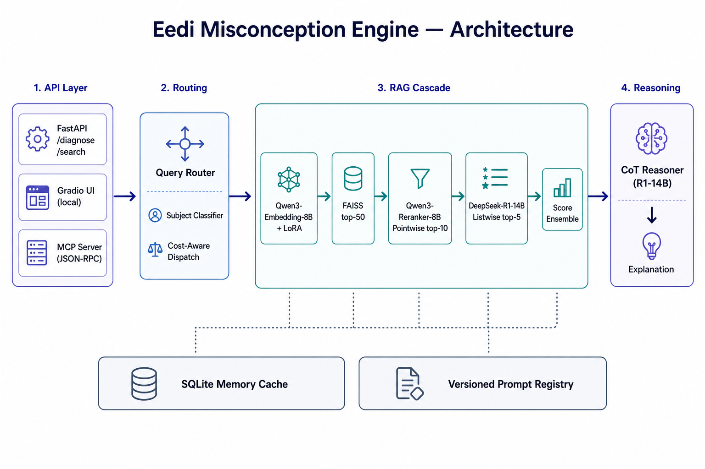
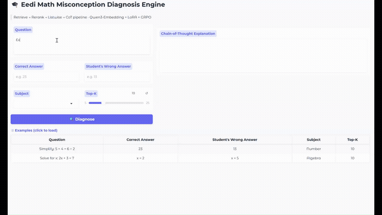
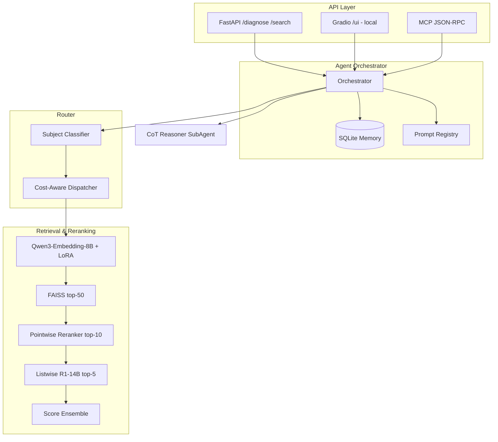
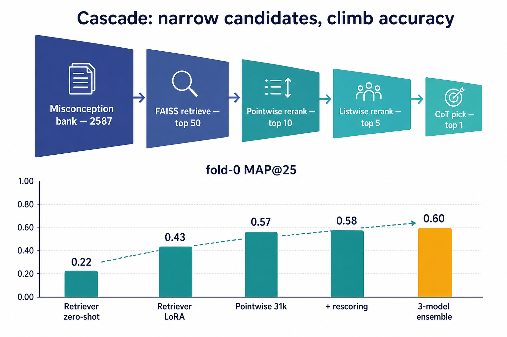

# Eedi Misconception Engine

[](https://www.python.org/)
[](https://fastapi.tiangolo.com/)
[](docker-compose.yml)
[](https://huggingface.co/spaces/Pyking828/eedi-misconception-demo)
[](https://huggingface.co/datasets/Pyking828/eedi-misconception-engine-assets)
[](https://www.kaggle.com/competitions/eedi-mining-misconceptions-in-mathematics)

End-to-end **math misconception retrieval & diagnosis** system built on the Kaggle competition
[**Eedi — Mining Misconceptions in Mathematics**](https://www.kaggle.com/competitions/eedi-mining-misconceptions-in-mathematics):
given a question, the correct answer, and a student's wrong answer, rank the most likely
misconception IDs from a fixed catalogue of 2587 (metric: MAP@25).

This repo turns that into a production-shaped service: dense retrieval with LoRA-tuned 8B
embeddings, pointwise + listwise reranking, cost-aware query routing, an async agent
orchestrator with CoT reasoning, and FastAPI / Gradio / MCP serving — reaching **fold-0
CV MAP@25 = 0.597** (≈ Kaggle private-LB top tier; the 1st place was 0.639).

<p align="center">
  
</p>

## Demo

<p align="center">
  
</p>

Two ways to see it run:

- **Zero-setup live demo (persistent):** **[🤗 Space — Pyking828/eedi-misconception-demo](https://huggingface.co/spaces/Pyking828/eedi-misconception-demo)** — lightweight CPU demo (`bge-m3` + FAISS retrieval over the 2587 misconceptions, precomputed embeddings for fast cold start). Stays up independently of any GPU instance.
- **Full GPU pipeline UI (local reproduction):** run the service yourself (see [Reproduce inference](#reproduce-inference)) and the Gradio UI is served at **your own** `http://localhost:6006/ui`. The demo GIF above was recorded on the author's GPU instance; there is intentionally **no permanently hosted full-pipeline URL** — the UI lives only for as long as *you* keep the service running, so anyone can reproduce it locally.

> Why this design: the heavy 8B/14B models can't run on a free CPU Space, and a personal cloud
> GPU instance is ephemeral. So the demo is split — a persistent CPU Space for the retrieval
> experience, and a reproducible local Gradio frontend for the full cascade.

## Highlights

1. **RAG retrieval** — Qwen3-Embedding-8B + LoRA + FAISS; competition MAP@25 from ~0.22 (zero-shot) to **0.597** (3-model ensemble).
2. **Intelligent routing** — subject classification + cost-aware dispatch (`retrieve_only` / `retrieve_rerank` / `full_pipeline`); SQLite memory cache for repeat queries.
3. **Agent orchestration** — async `Orchestrator` chaining Router → Retriever → Pointwise → Listwise → CoT reasoner; versioned Jinja prompts; MCP JSON-RPC server; SSE streaming.
4. **LoRA / SFT / RL stack** — retriever LoRA, Qwen3-Reranker-8B pointwise LoRA (31k & hn12), DeepSeek-R1-14B listwise SFT, plus a from-scratch GRPO experiment.

## Architecture



The pipeline narrows candidates at each stage while accuracy climbs:

<p align="center">
  
</p>

## Results & experiment log

All numbers are **fold-0 cross-validation** (874 validation queries), same eval protocol
across stages. The competition metric is MAP@25.

### The climb (0.22 → 0.597)

| Stage | MAP@25 | Recall@25 | Δ |
|-------|:------:|:---------:|:--:|
| Retriever 8B zero-shot | 0.2248 | 0.6535 | — |
| Retriever 8B LoRA (real data) | 0.4289 | 0.9416 | +0.204 |
| Pointwise reranker · 6k pairs | 0.4707 | 0.9153 | +0.042 |
| Pointwise reranker · 24k pairs | 0.5244 | 0.9142 | +0.054 |
| Pointwise reranker · 31k pairs | 0.5700 | 0.9211 | +0.046 |
| 31k + baseline-pool rescoring | 0.5807 | 0.9611 | +0.011 |
| hn12 + baseline-pool rescoring | 0.5842 | 0.9588 | +0.003 |
| 2-model ensemble | 0.5950 | 0.9611 | +0.011 |
| **3-model ensemble (final)** | **0.5974** | 0.9611 | +0.002 |

### Ablations & lessons learned

**1. Recall saturates early — MAP is a *ranking* problem.**
LoRA fine-tuning lifts Recall@25 from 0.65 → 0.94 almost immediately. After that the gold
misconception is *in* the top-50 ~96% of the time, so every later point of MAP comes from
**ordering**, not from finding more candidates. That's why the budget went into rerankers,
not a bigger retriever.

**2. Pointwise reranker quality is dominated by training-pair count/quality.**
6k → 24k → 31k hard-negative pairs: 0.47 → 0.52 → 0.57. The single biggest lever after
the retriever was simply mining more, harder negatives.

**3. Listwise helps only with the *option-logit* trick.**
Generative listwise ranking was poor zero-shot (MAP@25 ≈ 0.33). Reframing it as a single
forward pass that reads the **logits of the option-label tokens** (A…J) and SFT-ing on the
gold label is what made the R1-14B listwise stage competitive (0.572) — but it still only
*matches* a strong pointwise reranker, so it earns its place mainly as ensemble diversity.

**4. RL (GRPO) did not beat SFT — an honest negative result.**

| Method | MAP@25 |
|--------|:------:|
| Listwise zero-shot | 0.3254 |
| Listwise SFT (8B) | 0.5700 |
| Listwise SFT (R1-14B) | 0.5717 |
| GRPO v1 (top-1 hit reward) | 0.5700 |
| GRPO v2 (nDCG-gain reward) | **0.5741** |

A from-scratch GRPO objective (group-relative advantage + KL to a frozen SFT reference,
implemented directly because TRL's `GRPOTrainer` breaks on Blackwell `sm_120`) reached
0.5741 vs. 0.5737 for the SFT policy — i.e. **~0 lift for a lot of added complexity**. The
denser nDCG-gain reward beat the sparse top-1-hit reward, which is the one transferable
takeaway. SFT remains the strong, cheap baseline.

**5. Score fusion / scaling didn't help — keep it simple.**
Sweeping a blend factor that mixes retrieval similarity into the rerank score was best at
`factor = 1.0` (pure rerank score, MAP 0.5714); every blend made it worse. The reranker's
own score is already well-calibrated for ordering.

**6. Ensemble = diversity, weighted toward the strongest model.**
Final ensemble of `pointwise-hn8` + `pointwise-hn12` + `listwise-R1-14B` with weights
**0.25 / 0.50 / 0.25** gave **+0.013** over the best single model (0.5842 → 0.5974).

**7. Seen vs. unseen misconceptions — where the system is fragile.**

| Model | Seen (n=639) | Unseen (n=235) | All (n=874) |
|-------|:------------:|:--------------:|:-----------:|
| Retriever (real-only) | 0.4173 | **0.4604** | 0.4289 |
| Pointwise reranker (31k) | **0.6145** | 0.4496 | 0.5702 |

The reranker is dramatically stronger on misconceptions it saw in training (0.61) than on
unseen ones (0.45), while the **retriever actually generalizes *better* to unseen**
misconceptions than to seen ones. Practical implication: for novel/rare misconceptions,
trust the retriever; the reranker's gains concentrate on the seen distribution. This is also
why synthetic-data multistage pretraining was explored — to push unseen coverage — though in
our runs it only modestly traded overall MAP for unseen robustness, so it stayed off the
mainline.

## Tech stack

| Layer | Stack |
|-------|--------|
| API | FastAPI, Pydantic v2, SSE, Gradio |
| Models | Qwen3-Embedding/Reranker-8B, DeepSeek-R1-Distill-Qwen-14B |
| Training | PEFT LoRA, custom GRPO, FlagEmbedding |
| Index | FAISS IndexFlatIP |
| Memory | aiosqlite |
| Ops | Docker, docker-compose, GitHub Actions (ruff/pytest) |

## Reproduce inference

### Path A — Manual (local GPU)

```bash
git clone https://github.com/Pyking828/eedi-misconception-engine.git
cd eedi-misconception-engine
pip install -e .

# LoRA + FAISS index (~350 MB, no base weights)
bash scripts/download_adapters.sh

# Base models (local or mirror)
export HF_HOME=../hf_cache
huggingface-cli download Qwen/Qwen3-Embedding-8B
huggingface-cli download Qwen/Qwen3-Reranker-8B

# Point configs/base.yaml paths to your eedi-data/ and outputs/

# Light mode (API skeleton, no GPU models)
export EEDI_LIGHT=1
uvicorn service.app:app --host 0.0.0.0 --port 6006

# Full GPU pipeline
export EEDI_LIGHT=0
export EEDI_FORCE_FULL=1   # optional: always run rerank + CoT for demos
uvicorn service.app:app --host 0.0.0.0 --port 6006
```

Once it's running **on your machine**, open `http://localhost:6006/docs` (Swagger) or
`http://localhost:6006/ui` (the full Gradio UI). For a one-command full-pipeline demo with an
optional temporary public tunnel:

```bash
python scripts/demo_share.py            # serves http://localhost:6006/ui
EEDI_SHARE=1 python scripts/demo_share.py   # also opens a ~72h *.gradio.live tunnel
```

### Path B — Docker

```bash
git clone https://github.com/Pyking828/eedi-misconception-engine.git
cd eedi-misconception-engine

# Mount local hf_cache, eedi-data, outputs (create ../hf_cache if needed)
docker compose up --build
```

Set `EEDI_LIGHT=0` in `docker-compose.yml` when GPU weights are mounted under `/data/hf_cache`.

### Assets on Hugging Face

Pre-trained adapters and index (no base models):
**[Pyking828/eedi-misconception-engine-assets](https://huggingface.co/datasets/Pyking828/eedi-misconception-engine-assets)**

| Path | Description |
|------|-------------|
| `retriever/` | Qwen3-Embedding-8B LoRA |
| `reranker_best31k/` | Qwen3-Reranker-8B LoRA (hn8) |
| `reranker_hn12/` | Qwen3-Reranker-8B LoRA (hn12) |
| `listwise_r1_14b/` | R1-14B listwise SFT LoRA |
| `index/` | FAISS index, `misc_embs.npy`, `misc_ids.json`, mapping CSV |

## Reproduce training

See **[docs/TRAINING.md](docs/TRAINING.md)** for the full script order
(`prepare_data` → retriever → synth → reranker → listwise → GRPO → ensemble → serving).
You need your own GPU and the
[competition dataset](https://www.kaggle.com/competitions/eedi-mining-misconceptions-in-mathematics/data)
under `eedi-data/`.

## API reference

### `POST /diagnose`

```bash
curl -X POST http://localhost:6006/diagnose \
  -H "Content-Type: application/json" \
  -d '{
    "question_text": "Simplify: 5 × 4 + 6 ÷ 2",
    "correct_answer": "23",
    "wrong_answer": "13",
    "subject_name": "Number",
    "top_k": 10
  }'
```

### `POST /search` (retrieval only)

```bash
curl -X POST http://localhost:6006/search \
  -H "Content-Type: application/json" \
  -d '{"query": "fraction addition wrong denominator", "top_k": 5}'
```

### `GET /health`

```bash
curl http://localhost:6006/health
```

### `POST /diagnose/stream` (SSE)

Stream events: `candidates` → `rationale_token` → `final`.

## Project structure

```
eedi-misconception-engine/
├── assets/
│   ├── demo/             # demo.gif (looping, 1080px) + demo.mp4 (1080p original)
│   └── diagrams/         # architecture & cascade diagrams
├── configs/base.yaml     # paths and hyperparameters
├── docs/TRAINING.md      # training pipeline
├── eval/                 # MAP@25 / Recall / nDCG evaluator
├── mcp_server/           # MCP JSON-RPC server
├── prompts/              # Jinja templates (listwise, reasoner)
├── scripts/              # data prep, train, eval, serve (un-numbered, descriptive names)
├── service/app.py        # FastAPI + Gradio
├── spaces/               # deployable HF Spaces CPU demo
├── src/eedi/             # retriever, reranker, router, orchestrator, memory, synth, reasoner
├── tests/
├── Dockerfile
└── docker-compose.yml
```

## References

- [Kaggle: Eedi — Mining Misconceptions in Mathematics](https://www.kaggle.com/competitions/eedi-mining-misconceptions-in-mathematics) — original competition, data, and task definition
- [1st place solution (Raja Biswas)](https://github.com/rbiswasfc/eedi-mining-misconceptions) and its [detailed write-up](https://www.kaggle.com/competitions/eedi-mining-misconceptions-in-mathematics/writeups/mth-101-1st-place-detailed-solution)
- [Qwen-Agent](https://github.com/QwenLM/Qwen-Agent)
- [FlagEmbedding](https://github.com/FlagOpen/FlagEmbedding)

## License

MIT
